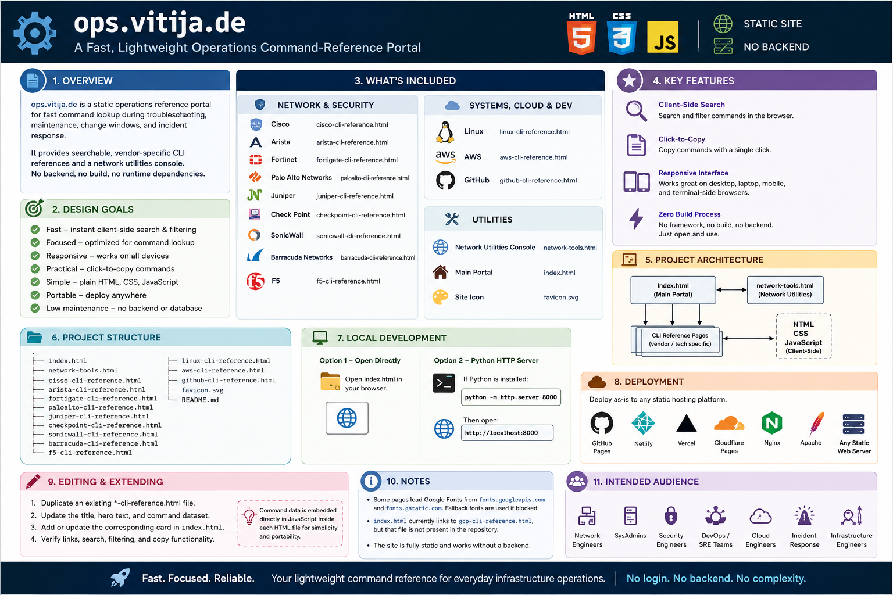

# ⚙️ ops.vitija.de

> **A fast, lightweight operations command-reference portal for network, security, Linux, cloud, and GitHub tooling.**

[](#)
[](#)
[](#)
[](#)
[](#)
[](#)

---


---

## 🗺️ Visual Study Guide


<p align="center">
  
</p>

## 🚀 Overview

**ops.vitija.de** is a static operations reference portal designed for **fast command lookup during troubleshooting, maintenance, change windows, and incident response**.

The portal provides searchable, vendor-specific CLI references together with a dedicated network utilities console. Each reference page is self-contained, making the project easy to maintain, deploy, and use without any application server or build pipeline.

### ✨ Design Goals

- ⚡ **Fast** — instant client-side search and filtering
- 🧭 **Focused** — optimized for operational command lookup
- 🖥️ **Responsive** — usable on desktop and mobile devices
- 📋 **Practical** — click-to-copy commands for quick execution
- 🧩 **Simple** — plain HTML, CSS, and JavaScript
- 🌐 **Portable** — deployable to virtually any static web host
- 🔒 **Low maintenance** — no backend, database, or framework

---

## 📚 What's Included

### 🌐 Network & Security

| Platform | Reference |
|---|---|
| 🔵 Cisco | `cisco-cli-reference.html` |
| 🔴 Arista | `arista-cli-reference.html` |
| 🛡️ Fortinet | `fortigate-cli-reference.html` |
| 🔥 Palo Alto Networks | `paloalto-cli-reference.html` |
| 🟢 Juniper | `juniper-cli-reference.html` |
| 🔐 Check Point | `checkpoint-cli-reference.html` |
| 🧱 SonicWall | `sonicwall-cli-reference.html` |
| 🛡️ Barracuda Networks | `barracuda-cli-reference.html` |
| ⚖️ F5 | `f5-cli-reference.html` |

### 🖥️ Systems, Cloud & Development

| Platform | Reference |
|---|---|
| 🐧 Linux | `linux-cli-reference.html` |
| ☁️ AWS | `aws-cli-reference.html` |
| 🐙 GitHub | `github-cli-reference.html` |

### 🧰 Utilities

- 🌐 **Network Utilities Console** — `network-tools.html`
- 🏠 **Main Portal** — `index.html`
- 🎨 **Site Icon** — `favicon.svg`

---

## ⭐ Key Features

### 🔎 Client-Side Search

Search and filter commands directly in the browser without server-side processing.

### 📋 Click-to-Copy

Commands can be copied directly from the reference pages, reducing manual typing and operational errors.

### 📱 Responsive Interface

The portal is designed to remain useful across:

- 🖥️ Desktop workstations
- 💻 Laptops
- 📱 Mobile devices
- 🧑‍💻 Terminal-side browser sessions

### ⚡ Zero Build Process

There is no:

- ❌ Framework
- ❌ Package manager
- ❌ Build pipeline
- ❌ Database
- ❌ Backend
- ❌ Application server

Just serve the files and use the portal.

---

## 🗂️ Project Structure

```text
.
├── index.html
├── network-tools.html
│
├── cisco-cli-reference.html
├── arista-cli-reference.html
├── fortigate-cli-reference.html
├── paloalto-cli-reference.html
├── juniper-cli-reference.html
├── checkpoint-cli-reference.html
├── sonicwall-cli-reference.html
├── barracuda-cli-reference.html
├── f5-cli-reference.html
│
├── linux-cli-reference.html
├── aws-cli-reference.html
├── github-cli-reference.html
│
├── favicon.svg
└── README.md
```

---

## 💻 Local Development

Because the project is completely static, you can run it without installing any dependencies.

### Option 1 — Open Directly

Simply open:

```text
index.html
```

in your preferred browser.

> 💡 This works for basic usage, although running a local HTTP server is recommended for a more realistic deployment environment.

### Option 2 — Python HTTP Server

If Python is installed:

```bash
python -m http.server 8000
```

Then open:

```text
http://localhost:8000
```

The portal should be available immediately.

---

## ☁️ Deployment

The project can be deployed **as-is** to virtually any static hosting platform.

### Supported Platforms

- 🐙 **GitHub Pages**
- 🟣 **Netlify**
- ▲ **Vercel**
- ☁️ **Cloudflare Pages**
- 🖥️ **Nginx**
- 🖥️ **Apache**
- 🌐 **Any standard static web server**

No special runtime environment is required.

### Deployment Requirements

Simply upload the project files and configure:

```text
index.html
```

as the default entry point.

---

## 🛠️ Editing & Extending

Adding a new vendor or technology reference is intentionally straightforward.

### Add a New Reference Page

1. 📄 Duplicate an existing `*-cli-reference.html` file.
2. ✏️ Update the page title and hero content.
3. 🧾 Update the embedded command dataset.
4. 🏠 Add the corresponding card/link to `index.html`.
5. 🔗 Verify navigation and internal links.
6. 🧪 Test search, filtering, and copy-to-clipboard functionality.

### Example

For a new platform called `example`:

```text
example-cli-reference.html
```

Then add the corresponding entry to:

```text
index.html
```

The current architecture keeps command data directly inside each HTML page's JavaScript, which makes individual references easy to edit and deploy independently.

---

## 🧱 Architecture

The portal intentionally uses a minimal architecture:

```text
┌──────────────────────────────┐
│           Browser            │
│                              │
│  ┌────────────────────────┐  │
│  │      index.html        │  │
│  └────────────┬───────────┘  │
│               │              │
│       ┌───────┴────────┐     │
│       │                │     │
│   Reference Pages   Network  │
│       │             Tools    │
│       │                │     │
│       └───────┬────────┘     │
│               │              │
│        HTML / CSS / JS       │
└──────────────────────────────┘
```

There is no application backend. All search, filtering, and interaction happens **client-side in the browser**.

---

## 🔐 Operational Characteristics

| Characteristic | Status |
|---|---|
| Backend required | ❌ No |
| Database required | ❌ No |
| Build step | ❌ No |
| Runtime dependencies | ❌ None |
| Client-side search | ✅ |
| Copy-to-clipboard | ✅ |
| Responsive UI | ✅ |
| Static hosting | ✅ |
| Offline-capable* | ✅ |

> \*Pages that depend on externally hosted resources, such as Google Fonts, may have reduced functionality or visual differences when completely offline.

---

## 📝 Notes & Known Items

### Google Fonts

Some pages load fonts from:

```text
fonts.googleapis.com
fonts.gstatic.com
```

If external font requests are blocked, the site will continue to render using configured fallback fonts.

### GCP Reference

`index.html` currently contains a link to:

```text
gcp-cli-reference.html
```

However, this file is **not currently present in the repository**.

If Google Cloud Platform support is intended, add the missing reference page or remove/update the corresponding link in `index.html`.

---

## 🎯 Intended Audience

**ops.vitija.de** is designed for anyone who needs quick access to operational commands, including:

- 🌐 Network Engineers
- 🖥️ Systems Administrators
- 🛡️ Security Engineers
- ☁️ Cloud Engineers
- 🔧 DevOps Engineers
- 🚀 SRE / Platform Teams
- 🚨 Incident Response Teams
- 👨‍💻 Infrastructure Engineers
- 📚 Anyone maintaining infrastructure and systems

---

## 💡 Why This Project?

During an incident or maintenance window, the goal is not to read extensive documentation — it's to **find the right command quickly**.

This project focuses on that exact workflow:

```text
Need a command
      ↓
Select platform
      ↓
Search reference
      ↓
Find command
      ↓
📋 Copy
      ↓
Execute
```

**Fast. Focused. No login. No backend. No unnecessary complexity.**

---

## 📄 License

Add your preferred license here if this repository is intended for public distribution.

For internal/private operational use, ensure that any included commands, procedures, or vendor-specific information comply with your organization's security and documentation policies.

---

<div align="center">

### ⚙️ ops.vitija.de

**Your lightweight command reference for everyday infrastructure operations.**

_Built for engineers. Designed for speed. Made to stay simple._

</div>
